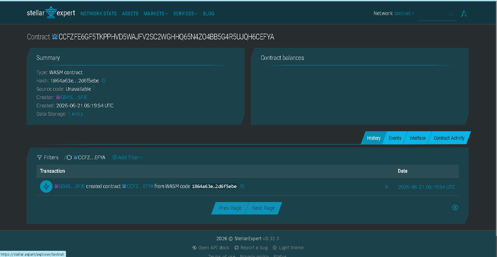

# FaithLedger

Decentralized financial oversight tool creating transparent, bucket-allocated smart escrow solutions for non-profits and faith ministries.

## Live Deployment (Stellar Testnet)
* **Contract ID:** `CCZFZE6GF5TKPPHVD5WAJFV2SC2WGHHQ65N4ZO4BB5G4R5UJQH6CEFYA`
* **Explorer Proof:**



## Problem & Solution
Donors to humanitarian and religious projects lack transparent pathways to monitor how their contributions are spent, resulting in lower giving due to localized trust gaps. FaithLedger programmatically locks inflows into distinct, verifiable ledger categories (Tithe, Outreach, Infrastructure) managed via transparent administrative multi-sigs built on Soroban.

## Timeline
Optimized for design and deployment within a weekend hackathon sprint cycle.

## Stellar Features Used
* **Stable Token Transfers** (Predictable asset handling avoiding sudden asset variance)
* **Soroban Smart Contracts** (State serialization of strict balance allocations)
* **On-Chain Audit Trails** (Instant cryptographic financial verification)

## Vision and Purpose
Restoring foundational public confidence in charitable ecosystems globally by building open-source, trustless budgeting rails.

## Prerequisites
* **Rust**: `rustc 1.75.0` or higher
* **Soroban CLI**: `soroban 21.0.0` or higher

## How to Build
```bash
soroban contract build